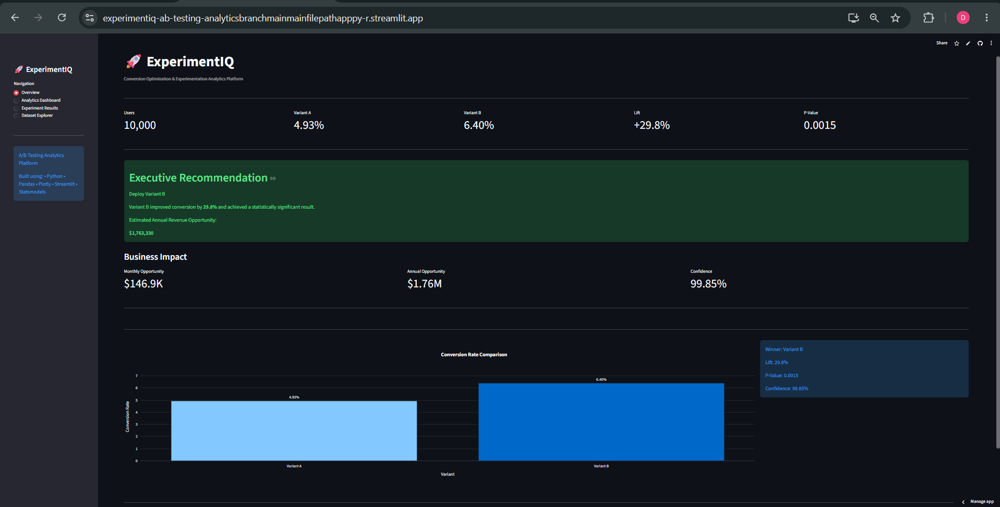
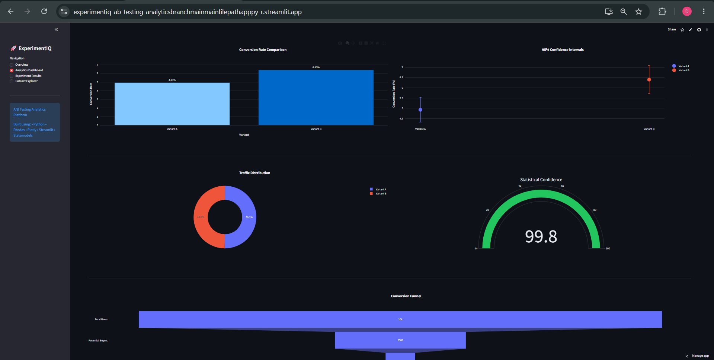
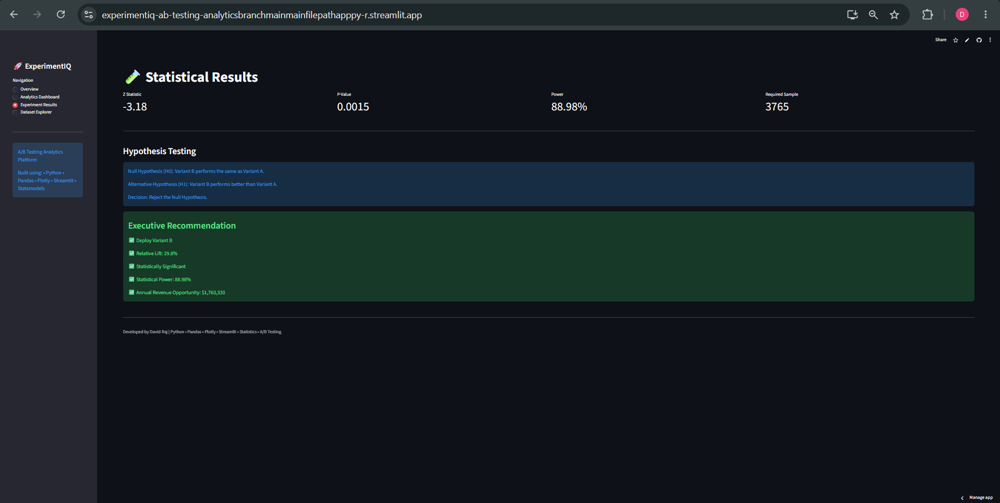
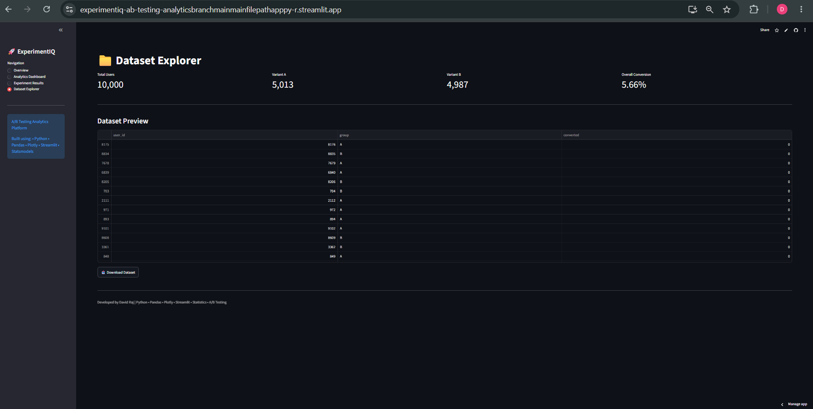

# 🚀 ExperimentIQ – A/B Testing Analytics Platform

An end-to-end experimentation analytics platform built using Python, Pandas, Statsmodels, Plotly, and Streamlit.

The platform enables data-driven decision-making by evaluating A/B test experiments through statistical significance testing, confidence interval analysis, power analysis, and revenue impact forecasting.

---

## 🌐 Live Demo

[View Live Application](YOUR_STREAMLIT_URL_HERE)

---

## 📊 Project Overview

ExperimentIQ helps product teams and analysts determine whether a new product variation should be deployed based on statistical evidence.

The platform provides:

* Conversion Rate Analysis
* Hypothesis Testing
* Confidence Intervals
* Statistical Power Analysis
* Revenue Impact Forecasting
* Interactive Executive Dashboard
* Dataset Exploration

---

## 🖼️ Dashboard Preview

### Overview Dashboard



### Analytics Dashboard



### Statistical Results



### Dataset Explorer



---

## ⚙️ Tech Stack

| Category        | Tools              |
| --------------- | ------------------ |
| Programming     | Python             |
| Data Analysis   | Pandas, NumPy      |
| Statistics      | SciPy, Statsmodels |
| Visualization   | Plotly             |
| Dashboard       | Streamlit          |
| Version Control | Git & GitHub       |
| Deployment      | Streamlit Cloud    |

---

## 📈 Key Metrics Calculated

### Conversion Rate

Conversion Rate = Converted Users / Total Users

### Relative Lift

Relative Lift = (Variant B − Variant A) / Variant A × 100

### Statistical Significance

* Z-Test
* P-Value Analysis
* Confidence Intervals

### Power Analysis

Determines whether the experiment had sufficient sample size to detect meaningful effects.

---

## 📂 Project Structure

```text
ExperimentIQ-AB-Testing-Analytics/
│
├── app.py
├── requirements.txt
├── README.md
│
├── data/
│   └── ab_test_data.csv
│
├── src/
│   ├── data_generator.py
│   ├── eda.py
│   ├── statistical_testing.py
│   ├── confidence_intervals.py
│   ├── power_analysis.py
│   ├── revenue_impact.py
│   ├── sample_size_calculator.py
│   └── generate_report.py
│
├── figures/
└── reports/
```

---

## 🚀 Installation

Clone the repository:

```bash
git clone https://github.com/Davidbirru/ExperimentIQ-AB-Testing-Analytics.git

cd ExperimentIQ-AB-Testing-Analytics
```

Install dependencies:

```bash
pip install -r requirements.txt
```

Run the Streamlit application:

```bash
streamlit run app.py
```

---

## 📌 Business Recommendation Example

Based on the experiment:

* Variant A Conversion Rate: 4.93%
* Variant B Conversion Rate: 6.40%
* Relative Lift: 29.8%
* Statistical Confidence: 99.85%
* Annual Revenue Opportunity: $1.76M

### Recommendation

Deploy Variant B to all users.

The experiment achieved statistical significance and demonstrated substantial projected business impact.

---

## 🎯 Skills Demonstrated

* A/B Testing
* Hypothesis Testing
* Statistical Analysis
* Data Visualization
* Product Analytics
* Business Intelligence
* Dashboard Development
* Python Programming
* Git & GitHub
* Cloud Deployment

---

## 👨‍💻 Author

David Raj Birru

GitHub: https://github.com/Davidbirru


